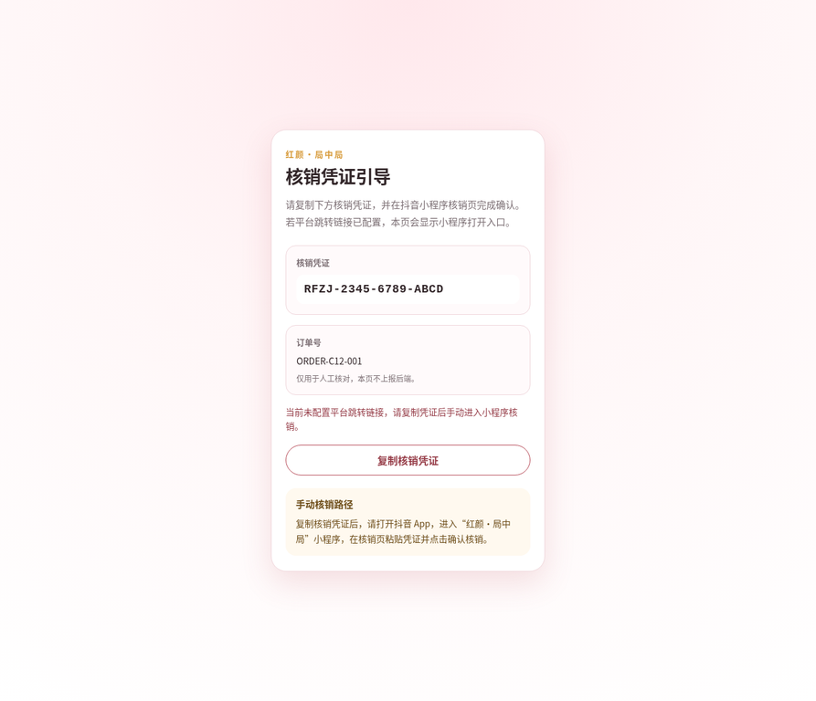
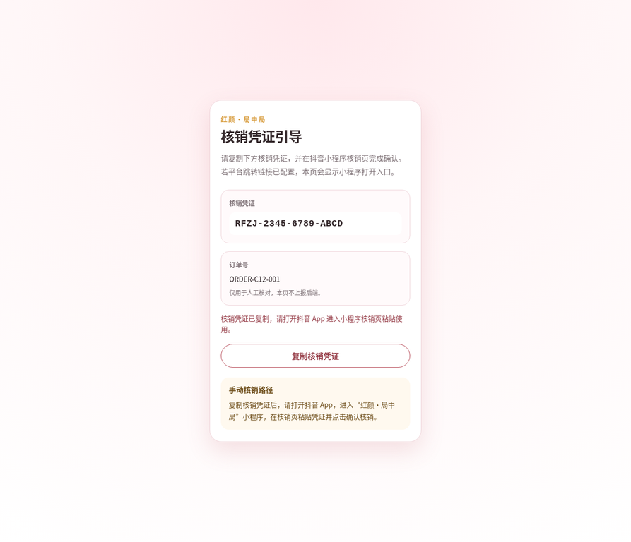

# C12 H5 Bridge 与全链路集成实施报告 v2

> 报告人：Manus AI  
> 日期：2026-06-17  
> 状态：推倒重来后重新完成编码与开发环境验证，待 6/22 真实环境测试  
> 关联任务：C12（H5 Bridge & Full-link Integration）

## 〇、重做说明

本报告是根据 John 的明确要求，在用户发送 Claude 裁定附件之后对此前 C12 产物进行**推倒重来**后的重新交付版本。此前由我在非目标模型状态下产生的 C12 H5、核销页更新、联调清单与实施报告已经通过 Git 可追溯回滚，回滚提交为 `4a0e85f` 与 `a2bcbd2`。本次重新执行从 Claude 裁定附件开始，不沿用已回滚的 C12 产物。

Claude 的裁定明确批准 C12 进入编码，但也给出了刚性边界：H5 必须采用**配置化跳转 + 复制降级**，禁止硬编码未验证 scheme；小程序核销页只允许在 `onLoad` 读取 `options.token` 预填；`oid` 仅展示不上报；未真机验证的项目必须标注为待验证。[1] [2]

> 本次重做采用“先回滚、再审计、再编码、再验证、再出文档”的顺序，避免把此前不可信产物混入新版本结论。

## 一、交付物范围

本次 C12 交付只触达 Claude 允许的边界，没有新增后端跳转链接生成接口，也没有修改 C2~C9 后端核心逻辑。H5 Bridge 是纯静态实现，便于部署到任意静态目录或 CDN；小程序端只做 token 预填，用户仍需主动点击确认核销。

| 类别 | 文件 | 说明 | 状态 |
|---|---|---|---|
| H5 Bridge | `frontend/h5-bridge/index.html` | 移动端 H5 引导页面，展示 token、oid 与核销路径 | 已新增 |
| H5 Bridge | `frontend/h5-bridge/style.css` | 移动端样式，默认展示复制降级路径 | 已新增 |
| H5 Bridge | `frontend/h5-bridge/script.js` | 解析 `t` 与 `oid` 参数；`miniProgramLinkBase` 默认留空；支持复制降级 | 已新增 |
| 小程序 | `frontend/douyin-miniprogram/pages/redeem/index.js` | `onLoad(options)` 读取 `options.token` 并按既有规则归一化 | 已最小修改 |
| 验证脚本 | `scripts/verify_c12_static.py` | 检查 H5 参数解析、无硬编码 scheme、无自动剪贴板读取和无自动核销 | 已新增 |
| 验证记录 | `C12_browser_verification_notes.md` | 记录 H5 本地浏览器验证结果与截图路径 | 已新增 |
| 联调清单 | `C12_Full_Link_Integration_Checklist_v2.md` | 6/22 真实环境测试作业指导书 | 已新增 |
| 本报告 | `C12_Implementation_Report_v2.md` | 本次重做后的实施报告 | 已新增 |

## 二、关键技术实现

H5 Bridge 默认将 `miniProgramLinkBase` 保持为空。在该状态下，页面不会展示“打开小程序核销页”的入口，而只展示“复制核销凭证”与手动进入小程序的降级路径。这一点严格对应 Claude 的裁定：在没有抖音官方跳转链接时，不得制造自动跳转承诺，更不得硬编码臆造的 `snssdk` 或其他 scheme。[1]

| 设计点 | 实现方式 | 蓝军审查结论 |
|---|---|---|
| token 参数 | H5 从 `t` 读取，展示为核销凭证 | 符合 Agiso 链路规划；不在 H5 修改 token 内容 |
| oid 参数 | H5 从 `oid` 读取，只展示并标注不上报后端 | 符合 C12 不处理订单追踪的边界 |
| 小程序跳转 | `miniProgramLinkBase` 留空；若后续填入官方链接，脚本追加 `token` 参数 | 当前不伪造跳转能力，等待 6/22 真机验证 |
| 复制降级 | 使用 `navigator.clipboard`，并提供 `document.execCommand('copy')` 兜底 | 可覆盖普通浏览器与部分非安全上下文场景 |
| 小程序预填 | `onLoad(options)` 仅在存在 `options.token` 时 setData | 没有自动读剪贴板，没有自动核销 |
| 后端接口 | 不新增、不修改 | 避免被 AppID、Secret、client_token 等平台依赖拖死 |

## 三、验证结果

本次验证严格区分“开发环境已验证”“代码级静态验证已通过”和“待 6/22 真机验证”。其中后端全量回归曾在首次 `mvn test` 时因为仓库中旧 `target/test-classes` 资源污染导致 H2 表缺失报错；该问题不是 C12 业务代码引入，清理后使用 `mvn clean test` 重新执行，58 个 JUnit 测试全部通过。

| 验证项 | 命令或方法 | 结果 | 结论 |
|---|---|---|---|
| H5 脚本语法 | `node --check frontend/h5-bridge/script.js` | 无语法错误 | 开发环境已验证 |
| C12 静态边界 | `python3 scripts/verify_c12_static.py` | 输出 `C12 static verification passed` | 开发环境已验证 |
| H5 浏览器展示 | `file://.../index.html?t=RFZJ-2345-6789-ABCD&oid=ORDER-C12-001` | token 与 oid 正确展示，默认不显示自动打开入口 | 开发环境已验证 |
| H5 复制交互 | 点击“复制核销凭证” | 页面提示核销凭证已复制 | 开发环境已验证 |
| 后端全量回归 | `cd backend/redface-backend && mvn clean test` | `Tests run: 58, Failures: 0, Errors: 0, Skipped: 0` | 开发环境已验证 |
| 小程序开发者工具预填 | 抖音开发者工具打开 `pages/redeem/index?token=...` | 未在当前沙箱验证 | 待 6/22 或本地工具验证 |
| 抖音官方跳转链接 | 配置 `miniProgramLinkBase` 并真机打开 | 未验证 | 待 6/22 真机验证 |
| Agiso 真实发货链接 | Agiso 插件生成 H5 链接 | 未验证 | 待 6/22 真实环境验证 |

## 四、H5 浏览器验证截图

本次尽力补充了 H5 静态页面截图，截图只证明本地浏览器中的 H5 参数解析、降级展示与复制提示，不代表抖音小程序真机跳转已经通过。

| 场景 | 截图 |
|---|---|
| 默认降级页面：展示 token、oid，且不显示自动打开入口 |  |
| 点击复制后：提示核销凭证已复制 |  |

## 五、风险与待办

当前 C12 的最大外部风险仍是抖音官方跳转链接能力与 Agiso 插件真实配置。按照 Claude 裁定，本卡不新增后端生成跳转链接接口，因为该接口需要 AppID、Secret、client_token 与企业主体权限，现阶段强行开发反而会拖慢 6/22 测试节奏。[1]

| 风险 | 当前处理 | 6/22 验证动作 |
|---|---|---|
| 抖音官方跳转链接未就绪 | `miniProgramLinkBase` 留空，只走复制降级 | 若获得官方链接，再填入配置并真机复测 |
| Agiso 参数名与模板不一致 | H5 当前读取 `t` 与 `oid` | 在 Agiso 现场确认模板变量映射 |
| 小程序真机预填未验证 | 已做代码级静态验证 | 使用体验版或开发者工具打开指定 page path 验证 |
| 管理后台联动未在沙箱三端跑通 | 后端回归通过，清单已列出现场步骤 | 在云环境进行端到端核销并核对后台数据 |
| 误把未验证项写成已通过 | 清单中逐项标注 | 现场测试逐项补截图与结果 |

## 六、结论

C12 在推倒重来后已经完成**开发环境可验证部分**：H5 Bridge 纯静态页、小程序核销页 token 预填、H5 浏览器验证、静态边界扫描和后端 58 项 JUnit 全量回归。未具备真实环境条件的部分已全部标注为“待 6/22 真机验证”，包括抖音官方跳转链接、Agiso 真实发货链路、小程序开发者工具或真机预填、云端端到端核销与管理后台数据核对。

从彩排底线角度看，C12 已经具备进入 6/22 真实环境测试的条件；但正式结论必须以 `C12_Full_Link_Integration_Checklist_v2.md` 的现场逐项测试结果为准。

## 七、引用

[1]: docs/c12/Claude_Ruling_C12_Final.md "Claude 裁定 — C12 技术方案确认（用户提供附件，已归档到仓库）"
[2]: https://github.com/gddjboy-stack/red-face-project/blob/main/C12_H5_Integration_Implementation_Plan_v1.md "C12_H5_Integration_Implementation_Plan_v1.md"
