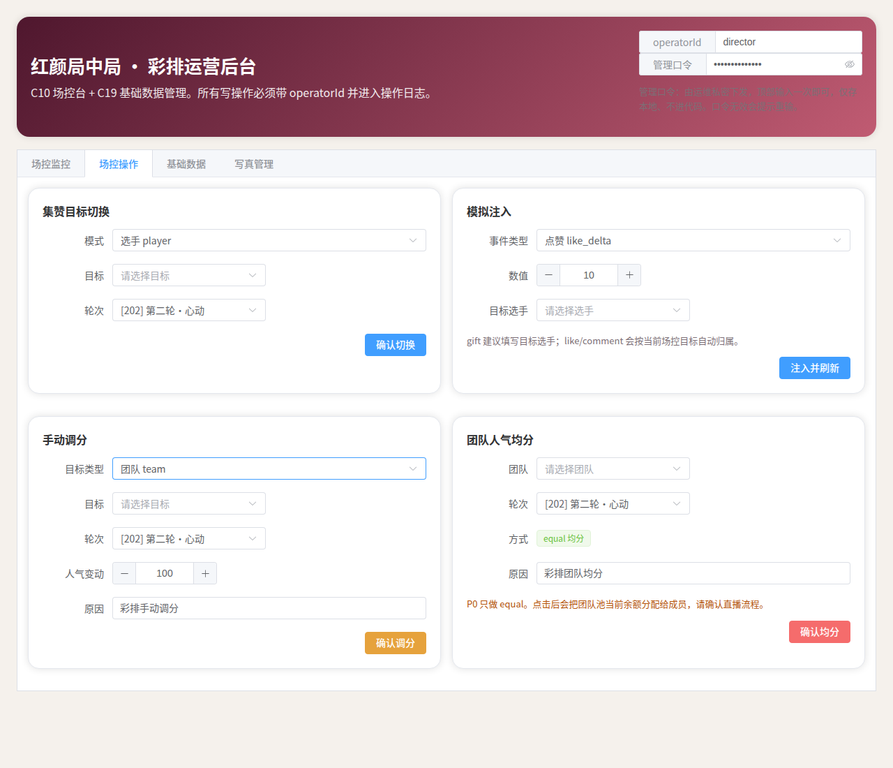
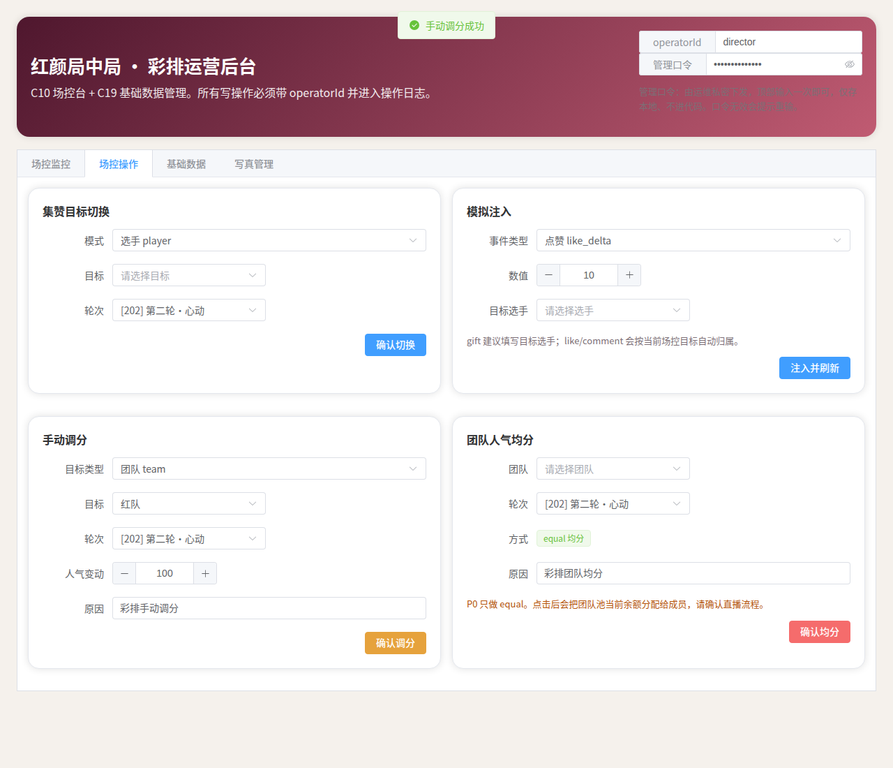
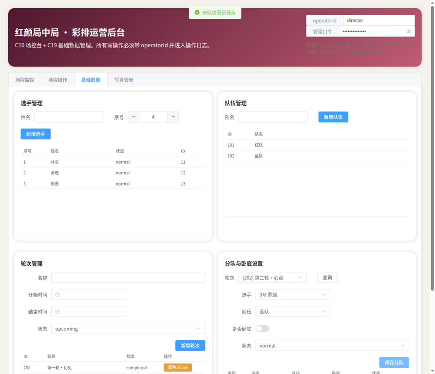

# 红颜局中局 · T4 场控后台下拉优化 — 回归测试报告

> 执行人：Manus (T4 流)
> 日期：2026.06.20
> 对应方案：T4_Technical_Plan（commit c0e64f1）
> Claude 裁定：Claude裁定_T4方案_批准（已批准编码）

## 一、改动范围

本次仅修改 **1 个文件**：`frontend/control-admin/src/App.vue`。

`git diff --name-only` 结果：

```
frontend/control-admin/src/App.vue
```

鉴权层（`http.ts`）、API 封装（`admin.ts`、`basicData.ts`、`photos.ts`）、后端任何代码均**未改动**，严守 T4 地盘，未越界 C18/C14。

## 二、改造内容概览

将 11 处 ID 数字输入框（`el-input-number`）改为下拉选择（`el-select`），下拉显示名称、绑定值仍为数字 ID：

| 页签 | 字段 | 数据源 | 显示文案 |
| --- | --- | --- | --- |
| 场控监控 | 人气看板 roundId | rounds | `[ID] 名称` |
| 场控操作 | 集赞目标（player/spy→选手，team→队伍，pool→禁用） | players/teams | `序号 姓名` / 队名 |
| 场控操作 | 集赞轮次 | rounds | `[ID] 名称` |
| 场控操作 | 模拟注入 目标选手 | players | `序号 姓名` |
| 场控操作 | 手动调分 目标（动态） | players/teams | `序号 姓名` / 队名 |
| 场控操作 | 手动调分 轮次 | rounds | `[ID] 名称` |
| 场控操作 | 团队均分 团队 | teams | 队名 |
| 场控操作 | 团队均分 轮次 | rounds | `[ID] 名称` |
| 基础数据 | 分队设置 查询轮次 | rounds | `[ID] 名称` |
| 基础数据 | 分队设置 选手 | players | `序号 姓名` |
| 基础数据 | 分队设置 队伍 | teams | 队名 |

### 落实 Claude 两项必处理意见

1. **空值占位不报错**：所有下拉绑定字段默认值由 `1` 改为 `null`，无数据时显示占位文案（如「请选择目标」），不会因 id=1 不存在而报错。数据加载后由 `applyDefaultRound()` 为轮次类下拉填充合理默认（优先 active 轮次）。
2. **切换目标类型时清空旧值**：新增 `onCollectModeChange()` / `onManualTypeChange()`，切换 player↔team↔spy↔pool 时清空 `targetId`，防止「选了选手、切到 team、却带着旧 ID 当 teamId」的串值。
3. **附加防呆**：各提交操作（集赞/手动调分/团队均分/分队保存/gift 注入）增加前端必选校验，未选时提示并拦截，避免向后端传 null。

## 三、回归测试结果

测试方式：本地 mock 后端（模拟 `/api/admin/**` 读写接口并校验 `X-Admin-Token`）+ 前端 dev server，逐项操作验证。

### 1. 前端构建

`pnpm build`（含 `vue-tsc --noEmit` 类型检查）：**通过**。仅有第三方库 `@vueuse` 的 PURE 注解告警与 chunk 体积告警，与本次改动无关。

### 2. 功能与传参验证

| 验证项 | 结果 | 证据 |
| --- | --- | --- |
| 各下拉正常显示名称、默认选中 active 轮次 | 通过 | roundId 显示「[202] 第二轮·心动」 |
| 切换目标类型清空旧值 | 通过 | 选「1号 林夏」后切 team，目标恢复「请选择目标」 |
| 手动调分传参为正确 ID | 通过 | payload `targetType=team, targetId=101, roundId=202` |
| 分队保存传参为正确 ID | 通过 | payload `playerId=13, teamId=102, roundId=202` |
| 空值占位不报错 | 通过 | 初始目标显示占位、无控制台报错 |
| 鉴权逻辑完好（带 token、401 重输） | 通过 | 首次进入弹口令框，保存后接口正常返回 |

**关键传参证据（mock 后端日志）：**

```
[WRITE] /api/admin/popularity/manual-adjust <- {"targetType":"team","targetId":101,"roundId":202,"rawValue":100,"reason":"彩排手动调分","operatorId":"director"}
[WRITE] /api/admin/player-round <- {"playerId":13,"teamId":102,"isSpy":false,"playerStatus":"normal","roundId":202,"operatorId":"director"}
```

`targetId` 传的是团队 ID 101（非此前所选选手 11），证明切换清空与值绑定均正确，后端 payload 结构与改造前完全一致。

### 3. 验证截图

| 切换清空 | 手动调分成功 | 分队保存成功 |
| --- | --- | --- |
|  |  |  |

## 四、结论

T4 改造完成，全部验证通过，改动范围严格限定在 App.vue 表单层，未触碰鉴权与后端。建议合入 main，为后续流提供干净的前端基线。

> 说明：回归用 mock 后端为临时验证脚本，已删除，不进入提交。`node_modules`、`dist` 等构建产物亦不提交。
