# 中控台销量录入 · 兼职人员培训材料

**版本** V1.0
**日期** 2026-08-02
**适用对象** 直播现场负责销量录入的兼职人员
**培训时长** 建议 40 分钟讲解 ＋ 20 分钟实机练习
**编写** Manus AI
**素材来源** 全部截图取自 2026-08-02 实机运行环境，逐屏实拍，非示意图

---

## 一、你只需要管一件事

这套后台有七个页签，但你**只需要用其中一个**：「销量录入」。

其余六个页签分别属于导演组和运维，涉及人气调分、卡密发放、退款处理等操作。它们不在你的职责范围内，也不在你的责任范围内。这一点必须先说清楚，因为当前系统的口令是**全页签通用**的，你手上的口令技术上能打开所有页面，但打开不等于该碰。

> 培训纪律第一条：除「销量录入」外，其余页签一律不点。看到别的页面上有按钮，不要好奇去试。

你的工作可以用一句话概括：**把抖店后台统计出的商品销量，一笔一笔录进系统，让它变成选手的人气值。**

| 页签 | 归属 | 你是否需要操作 |
| --- | --- | --- |
| 销量录入 | 兼职（你） | **是，这是你唯一的工作区** |
| 场控监控 | 导演组 | 否，可看不可动 |
| 场控操作 | 导演组 | 否，绝对不要打开 |
| 基础数据 | 运维 | 否 |
| 发码与导出 | 运维 | 否 |
| 退款管理 | 运营 | 否 |
| 写真管理 | 运维 | 否 |

---

## 二、开工前：输入口令

首次打开网址时，系统会弹出口令输入框，不输入无法进入任何功能。

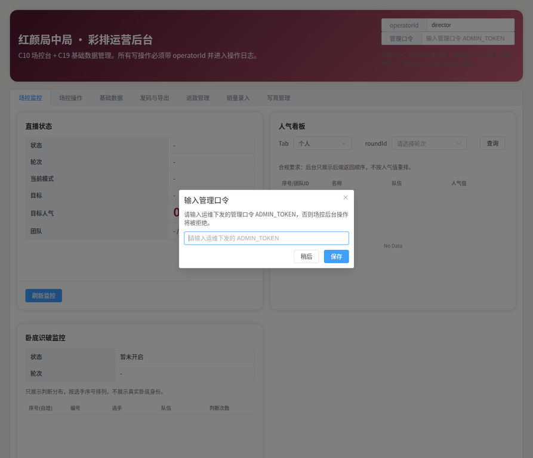

需要填两样东西。**operatorId** 填你自己的名字或代号，例如 `xiaomei`，它会被写进操作日志，将来每一笔录入都能追溯到具体是谁做的。**管理口令**由导演组当场私下告知，不要写在便签上贴屏幕，也不要转发到群里。

口令只需输入一次，保存在你这台电脑的浏览器里，刷新页面不用重输。若提示口令无效，找导演组重新确认，不要反复试。

> 提醒：operatorId 请填真实可识别的名字。它不是装饰字段，出事时它是唯一能还原「谁在什么时候录了什么」的线索。

---

## 三、核心概念：人气值是怎么算出来的

这是全部培训里最需要理解的一段。你录进去的是**件数**，系统存下来的是**人气值**，两者之间有一个固定的换算。

换算规则是：**商品原价 × 件数 × 10 = 人气值**（原价以元计，中间还有一次元转分）。

拿一个真实例子走一遍。林一的明信片原价 19.90 元，卖了 30 件：

| 步骤 | 运算 | 结果 |
| --- | --- | --- |
| 商品销售额 | 19.90 元 × 30 件 | 597.00 元 |
| 折算人气 | 597.00 × 1000 | 597,000 |

所以你在界面上看到的 **597,000** 是正确的。

**但这里有一个当前版本的界面问题，必须提前告诉你，否则你一定会以为系统算错了。**

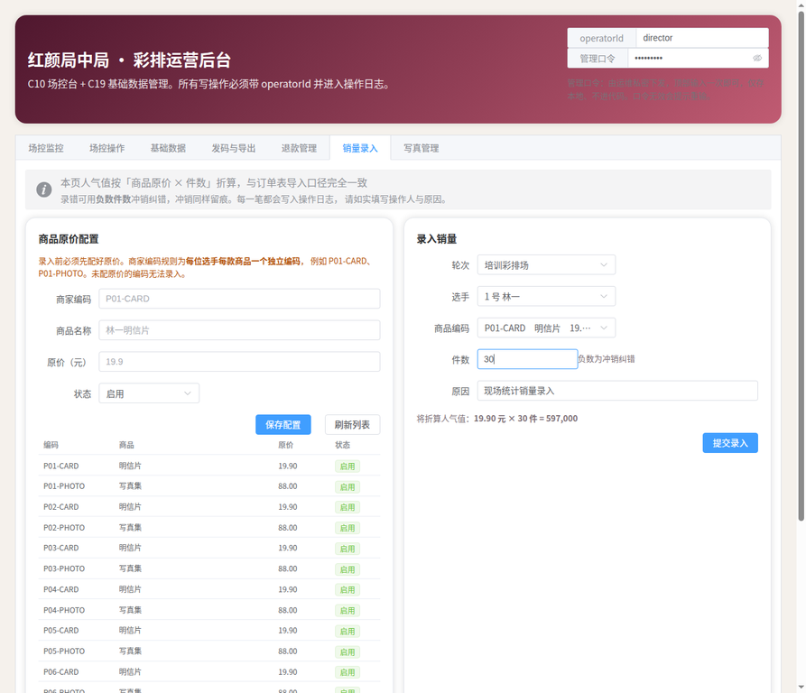

界面上写的是「将折算人气值：**19.90 元 × 30 件 = 597,000**」。19.90 乘 30 明明等于 597，界面却写成等于 597,000。这一行文案的写法是有问题的，它把「元」和「人气」两个不同的单位用等号连在了一起，中间的放大倍数没有交代。

请记住：**入账的数字是对的，只是这行字写得让人误解。** 这个问题已作为缺陷 DEFECT-002 上报，会在正式直播前修正。培训期间你看到这行等式，按上面的表格理解即可，不要因此怀疑系统。

> 你真正需要核对的不是等号右边那个大数字，而是**等号左边的单价和件数**。单价是否与这款商品的实际标价一致，件数是否与你手上的统计数字一致。这两个对了，右边的人气值就一定对。

---

## 四、录入一笔销量的完整动作

### 第一步：确认页面

点开「销量录入」页签。页面分上下两块：上半是「商品原价配置」和「录入销量」，下半是「本轮销量合计」。

左上的「商品原价配置」是**运维在开播前配好的**，你不要动它。你的操作区在右侧的「录入销量」。

### 第二步：填四个字段

| 字段 | 怎么填 | 注意 |
| --- | --- | --- |
| 轮次 | 选当前正在进行的轮次 | 换轮次时最容易忘记切，切错等于把这一轮的销量记到上一轮 |
| 选手 | 选「N 号 姓名」 | 认编号不要只认脸，同音名字容易点错 |
| 商品编码 | 选「编码　商品名　价格」 | 下拉框已经把商品名和价格显示出来了，务必看一眼 |
| 件数 | 填本次新增的件数 | 正数是新增，负数是冲销纠错 |
| 原因 | 简要写明依据 | 例如「21:15 抖店后台第三轮统计」 |

商品编码下拉框长这样，每一项都带商品名和单价：

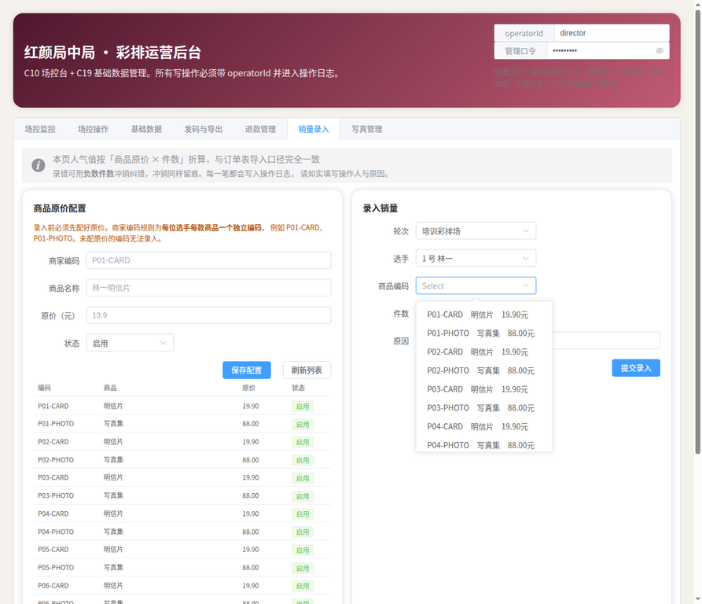

**每位选手的每款商品都有独立编码**，规则是编号加商品类型。林一的明信片是 P01-CARD，林一的写真集是 P01-PHOTO，李四的明信片是 P04-CARD。选错编码是这项工作最危险的错误，第七节会专门讲。

### 第三步：核对预览再提交

填完件数，提交按钮上方会出现折算预览。**这是你按下按钮前的最后一道自检**，看两件事：商品名对不对，单价对不对。

确认无误后点「提交录入」。成功后会出现绿色提示，同时下方合计表立刻更新。

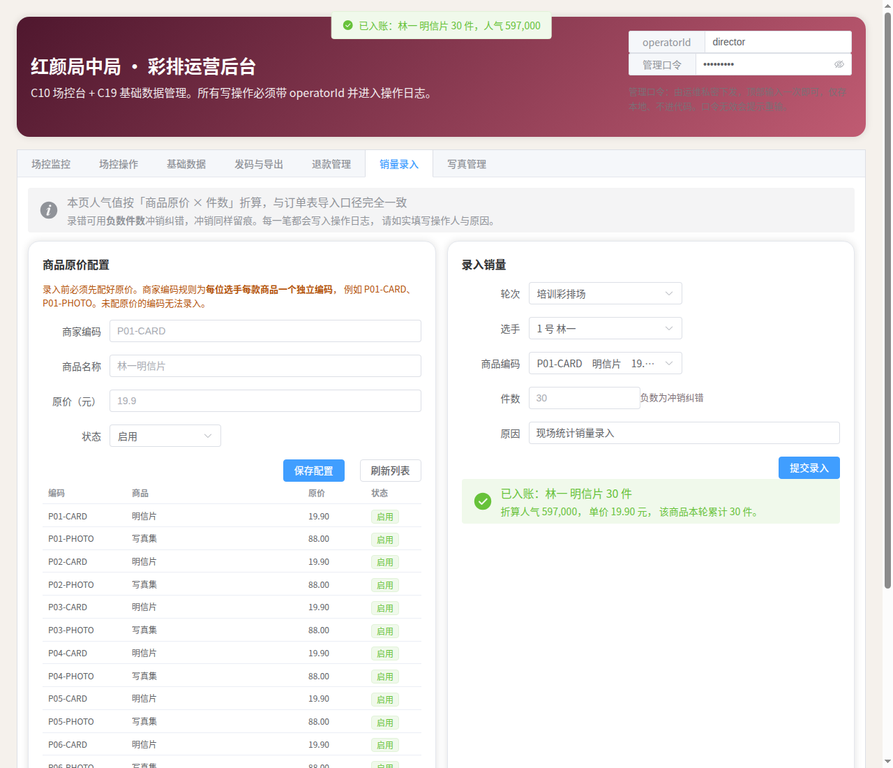

提示会写明「已入账：林一 明信片 30 件，折算人气 597,000，单价 19.90 元，该商品本轮累计 30 件」。**看到「已入账」三个字，这一笔才算真正记上了。**

---

## 五、每轮结束前必做：核对合计

下方的「本轮销量合计」是你的对账工具。点选手行左侧的展开箭头，可以看到这位选手每款商品的明细。

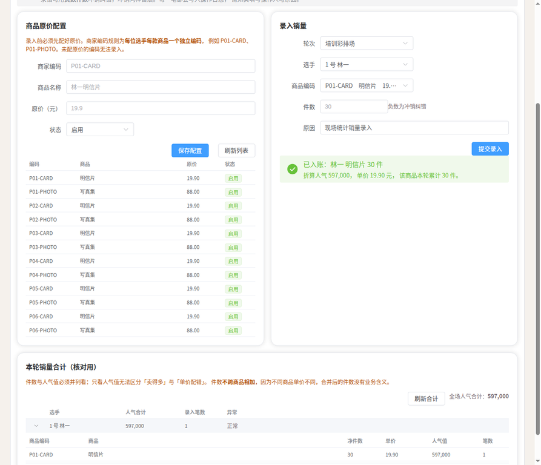

明细共六列：商品编码、商品、净件数、单价、人气值、笔数。

**为什么要同时看件数和人气值？** 因为只看人气值分不清两种完全不同的情况：一种是这款商品真的卖得多，另一种是单价被配错了。举例来说，如果你看到明信片的人气值高得离谱，展开一看单价显示 199.00 元而不是 19.90 元，那就是运维配置出了问题，必须立刻叫停，而不是继续录。

**为什么件数不跨商品相加？** 因为明信片 19.90 元、写真集 88.00 元，把 30 件明信片和 5 件写真集加成 35 件毫无意义。系统按商品分行显示，你也要按商品分别核对。

「净件数」的意思是加上冲销之后的结果。如果你录了 30 件又冲销了 5 件，这里显示 25，笔数显示 2。

> 每轮结束前，把每位选手每款商品的净件数与你手上的统计单逐项对一遍。这是最后一道防线，一旦进入结算就很难改了。

---

## 六、三种系统会拦住你的情况

系统设了三道拦截。**看到弹窗不要慌，也不要习惯性地点确认**，先读完文字再决定。

### 情况一：件数没填或填了 0

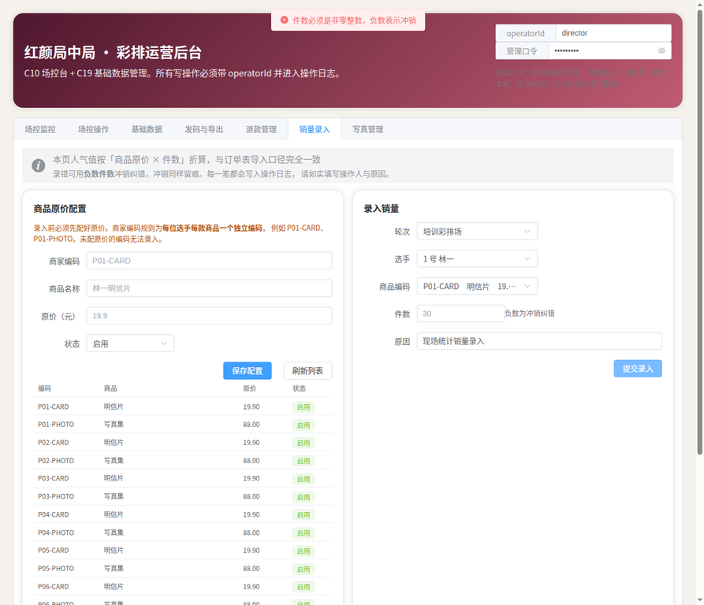

提示「件数必须是非零整数，负数表示冲销」。这是硬性拦截，填上正确件数即可。

### 情况二：60 秒内录了完全相同的一笔

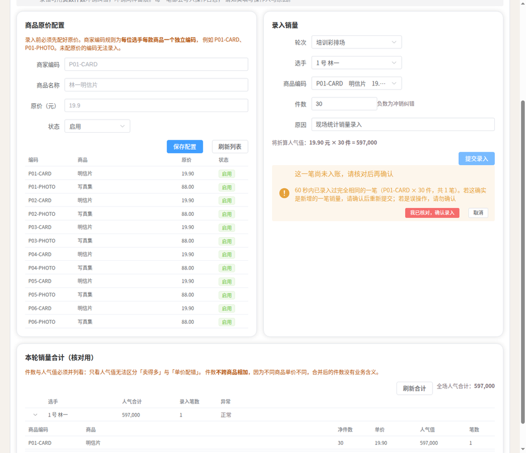

提示原文是「60 秒内已录入过完全相同的一笔（P01-CARD × 30 件，共 1 笔）。若这确实是新增的一笔销量，请确认后重新提交；若是误操作，请勿确认」。

**注意黄框上方那行字：「这一笔尚未入账，请核对后再确认」。** 这一刻数据还没进系统，你有两个选择：

- 如果是手滑点了两次提交，点**「取消」**。
- 如果确实是短时间内又卖了 30 件，点**「我已核对，确认录入」**。

这道拦截存在的意义就是防手滑。**如果你不确定刚才那一笔到底提交成功了没有，正确做法是点取消，然后去下方合计表看笔数。** 猜测不如查证。

### 情况三：单笔件数超过 200

这一种有**两层**提示，都要看。

第一层在你打字的时候就出现了，输入框下方冒出黄字：

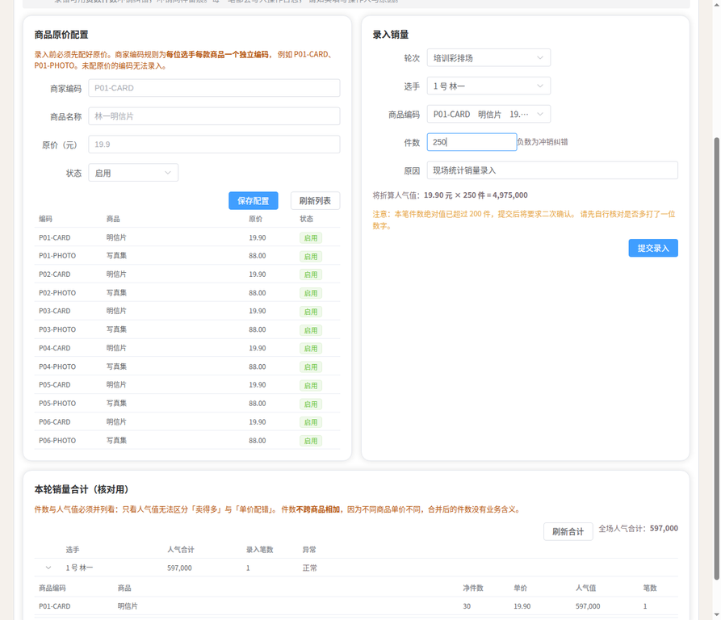

原文是「注意：本笔件数绝对值已超过 200 件，提交后将要求二次确认。请先自行核对是否多打了一位数字」。这一层的价值在于**你还没提交就已经被提醒了**，多打一个零这种错误在这一秒就能改掉。

如果你无视它继续提交，第二层弹窗出现：

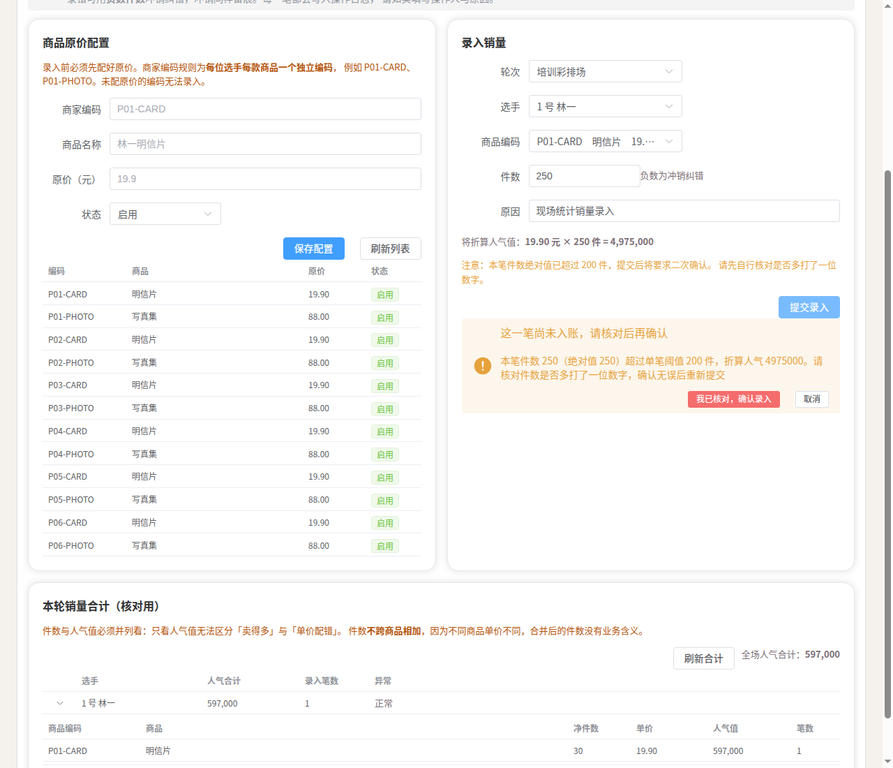

原文是「本笔件数 250（绝对值 250）超过单笔阈值 200 件，折算人气 4975000。请核对件数是否多打了一位数字，确认无误后重新提交」。

**这个数字要认真看。** 250 件明信片对应 497.5 万人气，而正常的 25 件只有 49.75 万，差十倍。在选手排名里，十倍的差距足以直接颠倒名次。多打一个零不是小失误，它会改变比赛结果。

确认真的卖了 250 件，就点确认；有任何一丝犹豫，点取消去核对统计单。

---

## 七、录错了怎么办：用负数冲销

系统**不提供删除功能**，录错只能用负数冲销。这是有意的设计，因为删除会让账本失去痕迹，而冲销会留下完整记录：错误的那一笔在，纠正的那一笔也在，谁在什么时候纠正的都在。

### 冲销的做法

选择与错误那一笔**完全相同**的轮次、选手、商品编码，件数填负数，原因写明为什么要冲销。

比如刚才 30 件里有 5 件是重复统计的，就填 -5：

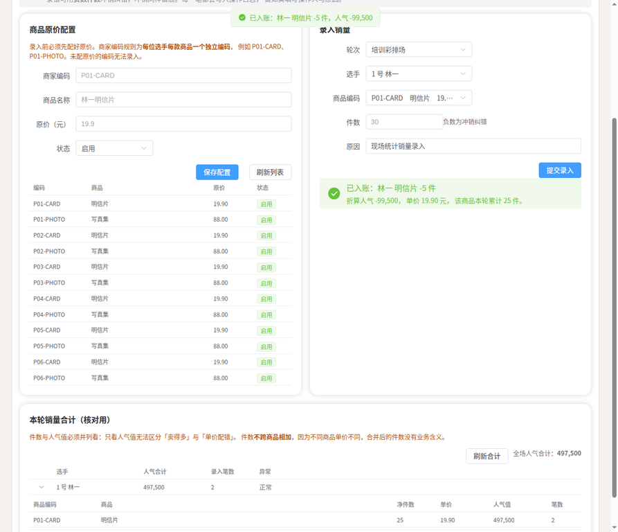

提示「已入账：林一 明信片 -5 件，人气 -99,500」，合计表的净件数从 30 变成 25，笔数从 1 变成 2，全场人气合计从 597,000 降到 497,500。

### 冲销不能超过已录量

如果你填 -50，而该商品本轮只录了 30 件，系统会直接拒绝：

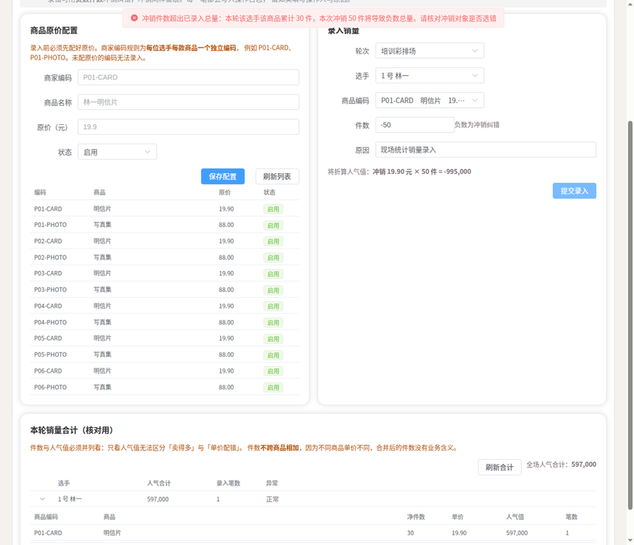

提示原文是「冲销件数超出已录入总量：本轮该选手该商品累计 30 件，本次冲销 50 件将导致负数总量。请核对冲销对象是否选错」。

这条拦截的真正含义值得多说一句。它拦下的通常不是「冲销数量填多了」，而是**「你冲销的对象选错了」**。当你想冲销的件数超过了这个商品的已录总量，最可能的解释是你把冲销记到了另一个商品或另一位选手名下。看到这个提示，第一件事是回头确认商品编码和选手，而不是把 50 改小成 30。

---

## 八、最危险的一种错误：选错商品编码

前面所有拦截的共同前提是**数字本身可疑**。但有一种错误，所有数字都完全正常，系统一个字都不会提示。

**这就是选错商品编码。**

你想录「林一的明信片 30 件」，却选中了「林一的写真集」。件数 30 是真实的，不触发异常阈值；这是全新的一笔，不触发软重复；是正向录入，不涉及冲销校验。系统会平静地接受它，绿色提示照常出现，一切看起来都对。

但明信片少了 30 件的人气（59.7 万），写真集多了 30 件的人气（264 万），两位数字都被记到了错的地方。而写真集单价是明信片的四倍多，这个错误造成的人气偏差超过 200 万，足以颠覆排名。

**系统为什么拦不住？** 因为系统只知道「选手编号 + 商品编码 + 件数」这三个数字，而「你心里想录的是哪款商品」这个信息从来没有进入系统。它能校验数字之间的关系，无法校验数字和你的意图之间的关系。

所以这一条只能靠你自己。三个动作可以显著降低风险：

第一，**提交前读一遍预览行的商品名**。预览里明确写着「明信片」还是「写真集」，读出声更好。

第二，**留意单价**。明信片 19.90，写真集 88.00，两个数字差得很远，看单价比看商品名更容易发现问题。

第三，**每轮结束展开合计明细逐项对**。如果某位选手的写真集突然出现 30 件而现场根本没卖那么多，就是这个错误发生了。

> 这一条已作为已知风险 RISK-B1 归档，导演组知晓。它无法靠系统消除，只能靠操作纪律。

---

## 九、实机练习清单

正式上岗前，请在培训环境完成以下八项，每项都要看到预期结果。

| 序号 | 练习内容 | 预期结果 |
| --- | --- | --- |
| 1 | 输入 operatorId 与口令进入系统 | 顺利进入，页签可点 |
| 2 | 打开「销量录入」页签 | 看到原价配置与录入表单 |
| 3 | 不填件数直接提交 | 被拒，提示件数必须是非零整数 |
| 4 | 正常录入 1 号林一明信片 30 件 | 出现「已入账」，合计出现 597,000 |
| 5 | 展开合计明细 | 看到净件数 30、单价 19.90、笔数 1 |
| 6 | 立即重复提交同样内容 | 出现软重复弹窗，练习点「取消」 |
| 7 | 填 250 件提交 | 先看到黄字预警，再看到二次确认，练习点「取消」 |
| 8 | 填 -5 件冲销 | 净件数变 25，笔数变 2 |

八项全部做过一遍，你就见过这套系统所有会拦你的场景了。

---

## 十、五条纪律

一、**只用「销量录入」页签**，其余页签一律不点。

二、**提交前读预览行的商品名和单价**，不要只盯人气值。

三、**看到弹窗先读完文字再决定**，不要习惯性点确认。

四、**不确定是否提交成功时，去合计表查笔数**，不要凭记忆重录。

五、**每轮结束前展开合计明细逐项核对**，发现异常立刻报导演组，不要自己想办法补救。

---

## 附录：当前版本的三个已知问题

培训时应主动告知受训人员，避免现场困惑。

| 编号 | 现象 | 对你的影响 | 状态 |
| --- | --- | --- | --- |
| DEFECT-002 | 预览行写「19.90 元 × 30 件 = 597,000」，等式看起来算错 | 入账数字是对的，按第三节的表格理解 | 已上报，直播前修 |
| DEFECT-003 | 「发码与导出」页选手编号显示 null | 与你无关，你不会打开那一页 | 已上报 |
| RISK-B1 | 选错商品编码系统无法察觉 | 需靠第八节的三个动作自己防 | 已归档，无法靠系统消除 |
